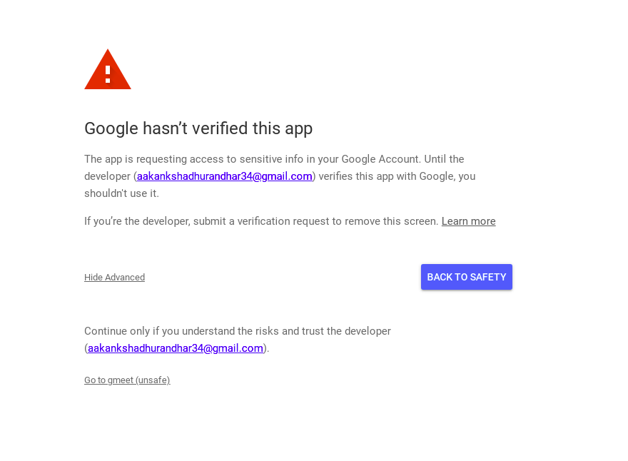

# :shamrock: Google-chrome-extension assingment

## Technologies used :rocket:

- React Hooks 17
- Webpack 5
- Prettier
- eslint-config-react-app
- Calender API
- Outh Client 2.0 ( for authentication and authorization.)
- chrome.storage (for retrieving cached email)
- chrome.commands (for adding shortcuts in chrome extension)
- chrome.identity (get OAuth2 access tokens.)

## Installing and Running

### How to install extension :hammer:

1. Check if your [Node.js](https://nodejs.org/) version is >= **14**.
2. Clone this repository.
3. Run `npm install` to install the dependencies.
4. Run `npm start`
5. Load your extension on Chrome following:
   1. Access `chrome://extensions/`
   2. Check `Developer mode`
   3. Click on `Load unpacked extension`
   4. Select the `build` folder.
6. Happy hacking.

### How to use extension :bamboo:

- For creating new meeting - Use **ALT + X** or **New Meeting** button.
- For copying meet link - Use **ALT + Y** or **Copy from clipboard**
- For Switching user - Click on Switch user button and after selecting
  account -> Go to advanced -> go to gmeet(unsafe)
  

### Demo

### To-do

- [x] Make a Google Chrome extension to allow users to create a new  
       Google Meet meeting and quickly share the meeting link with others.
- [x] Allow users to choose which email to create meetings if they have
      multiple Google Accounts.
- [x] Cache the selected email for further meetings.
- [x] Optimize the act of meeting creation by allowing users to create and
      share links only using Keyboard shortcuts.

### New Improvements

- [] Make standardjs.com or prettier part of the commit hook.

### Note

- The Extension key in manifest and oauth client id are not hidden on purpose of testing.
- By default the meet time is set to 60min .

## Resources

- [Webpack documentation](https://webpack.js.org/concepts/)
- [Chrome Extension documentation](https://developer.chrome.com/extensions/getstarted)
- [Calender API authorization](https://developers.google.com/calendar/api/guides/auth)
- [Calender API create events](https://developers.google.com/calendar/api/guides/create-events)
- [React chrome Extension Boilerplate](https://github.com/lxieyang/chrome-extension-boilerplate-react)
- [Calender API playground](https://developers.google.com/calendar/api/v3/reference/events)
- [Oauth 2.0 docs](https://developers.google.com/identity/protocols/oauth2)
